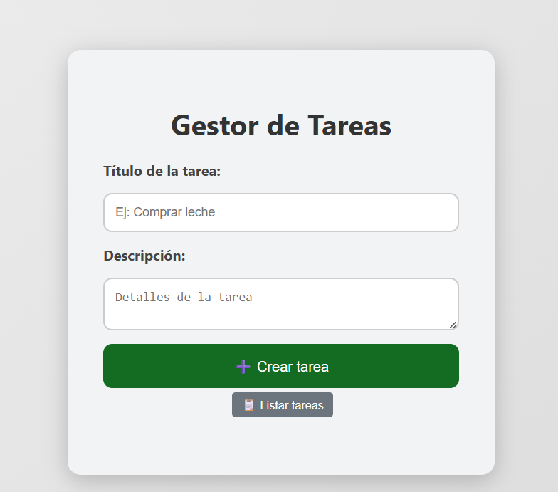
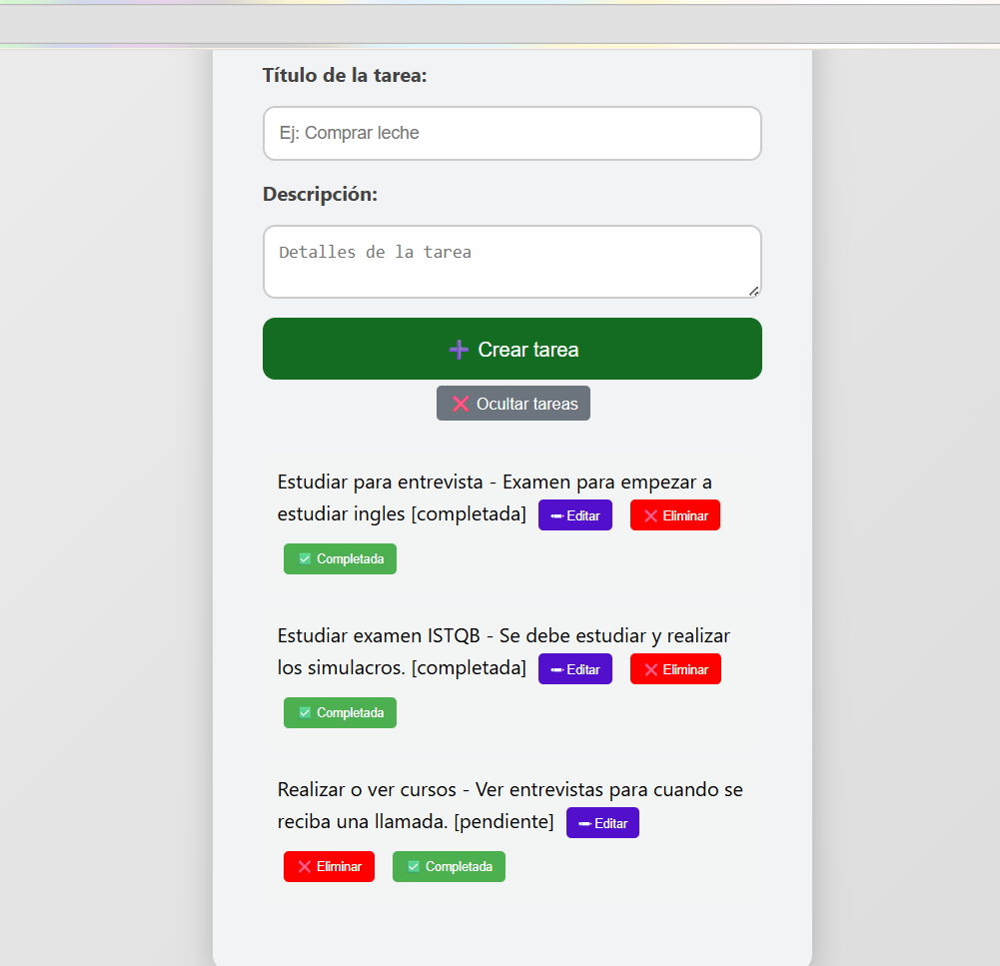

# Gestor de Tareas

Este es mi **proyecto personal**, desarrollado con el objetivo de practicar y demostrar mis habilidades en desarrollo web y pruebas de software.  
Se trata de una aplicación que implementa una **interfaz gráfica amigable**, conexión a una **base de datos SQL Server**, y estilos personalizados con **CSS** para mejorar la experiencia del usuario.

## ✨ Funcionalidades principales

- **Crear tareas** con título y descripción.  
- **Listar tareas** registradas en la base de datos.  
- **Editar tareas** existentes para actualizar su información.  
- **Eliminar tareas** que ya no sean necesarias.  
- **Cambiar el estado** de una tarea (pendiente ↔ completada).  
- **Persistencia de datos** gracias a la integración con SQL Server.  

## 🛠️ Tecnologías utilizadas

- **Frontend:** HTML, CSS, JavaScript  
- **Backend:** Python con Flask  
- **Base de datos:** SQL Server  
- **Pruebas automatizadas:** Gherkin (BDD)  

## 🚀 Instalación

1. Clona el repositorio:
   ```bash
   git clone https://github.com/Yolanda3757/miproyecto.git

## Pantallazos de la aplicación

## Pantalla principal


## Lista de tareas


## 🤖 Bot de Tareas Automáticas
Este proyecto incluye un script llamado bot_tareas.py dentro de la carpeta backend.
Su función es crear tareas automáticamente en el Gestor de Tareas, enviando peticiones al servidor Flask mediante la librería requests.

## 🔎 Características
Genera tareas con títulos y descripciones aleatorias cada vez que se ejecuta.

Se conecta al endpoint Flask en http://127.0.0.1:5000/tareas.

Inserta las tareas directamente en la base de datos, visibles luego en el frontend (index.html).
